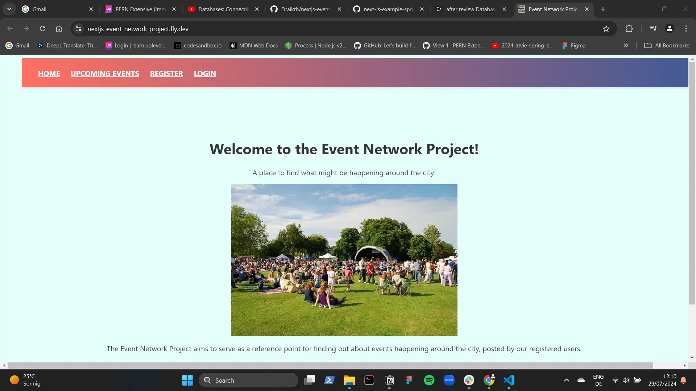
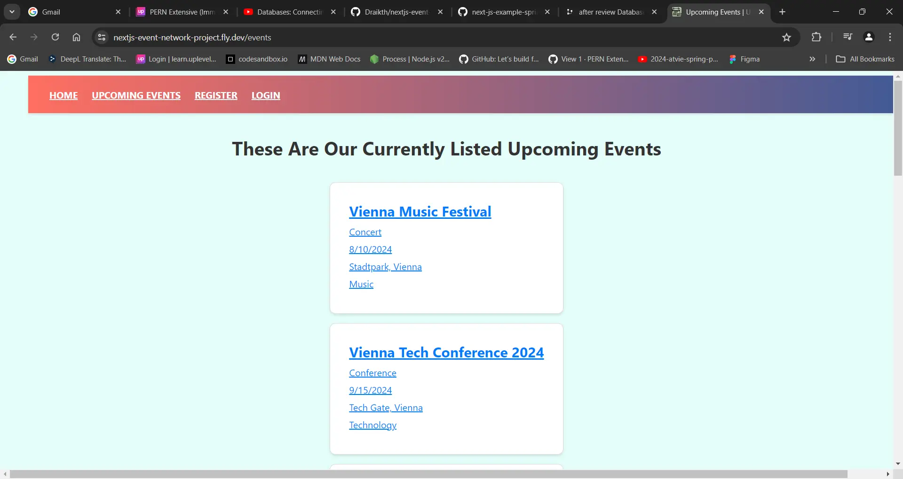
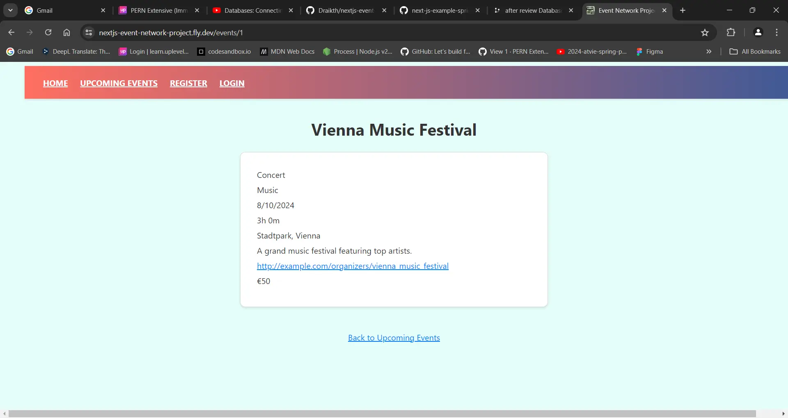
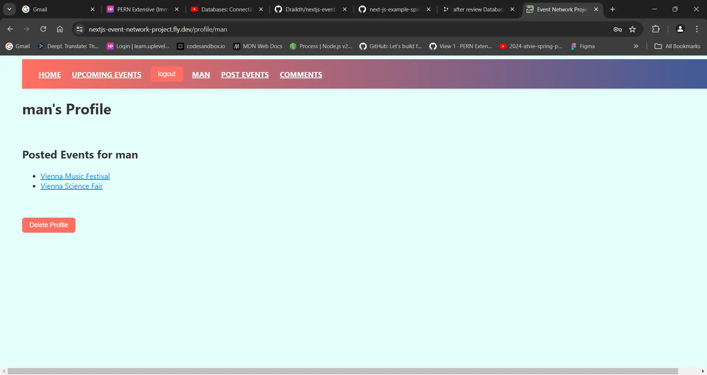
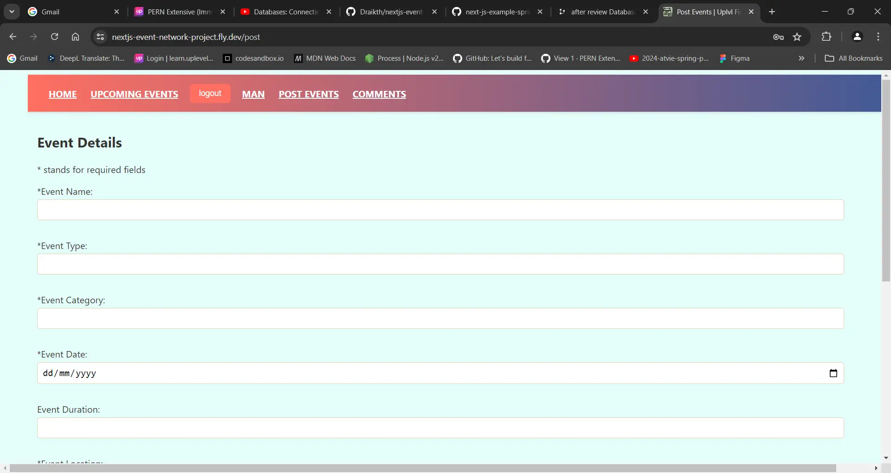

# Next.js Event Network Project

## Description

The main idea is that this is a site you go to for seeing what kind of various events are happening around the city, is there a concert? a large festival, a small festival, a renaissance fair, that one performance of McBeth happening in the local graveyard? you should be able to go to this site and find out without having to hope you see the poster on some random lamppost or stumble upon something that looks interesting and you maybe would've liked to attend, already happening when you are out and about.

The site is supposed to act as a collective reference point for all these various events happening in and around the city, a marketing point even, though the site itself is not intended to be a point of sale for tickets... at least not within the scope of the project (If i have time, then maybe I can look at making it something like that in the future...)

## Functionalities

- A landing page
- User Registration, Login, Logout and User Delete
- User profile page with links to individual posted events
- All Upcoming Events page
- Single event Page
- Posting of New Event

## Technologies

- Next.js
- TypeScript
- SASS CSS
- PostgreSQL
- Jest unit tests
- Playwright end to end testing
- DrawSQL https://drawsql.app/teams/final-project-21/diagrams/after-review-database-for-upleveled-fin-project

## Setup Instructions

- Clone the repository with `git clone <repo>`
- Setup the database by downloading and installing PostgreSQL
- Create a user and a database
- Create a new file `.env`
- Copy the environment variables from `.env-example` into `.env`
- Replace the placeholders xxxxx with your username, password and name of database
- Install dotenv-safe with `pnpm add dotenv-safe`
- Run `pnpm install` in your command line
- Run the migrations with `pnpm migrate up`
- Start the server by running `pnpm dev`

## Run Tests

To run unit tests with Jest, use the following command:

```bash
pnpm jest
```

To run end-to-end tests with Playwright, use the following command:

```bash
pnpm playwright test
```

## Deployment

- Fly.io
- Docker

## Screenshots






